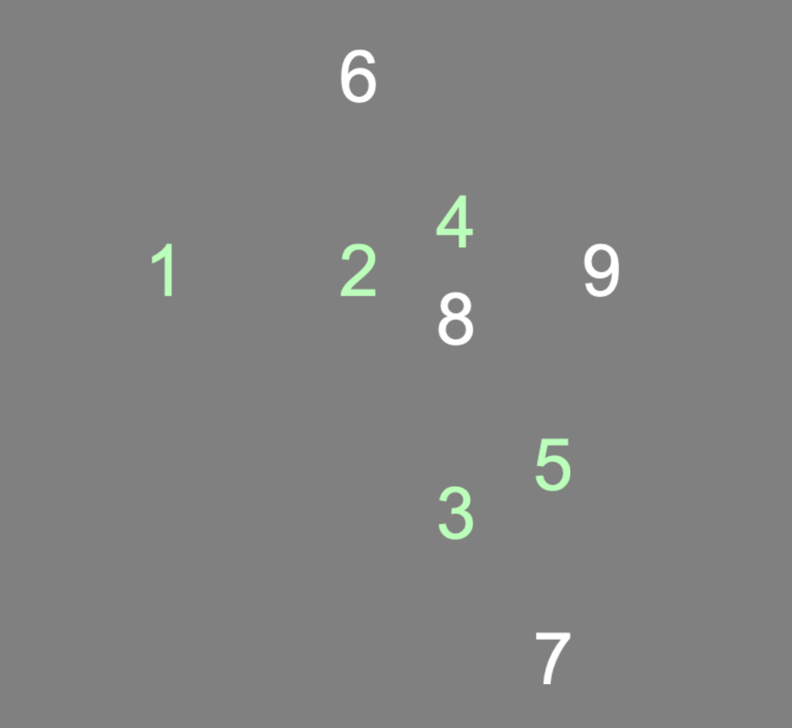

# Psychopy Click Response Times Experiment

This is a [Psychopy](https://psychopy.org) project consisting of an experimental task with trials where the participant is prompted to click numbers in ascending order. The task's main purpose is to measure participants' click response times, which can then be used for generating a baseline to which response times for other experiments can be compared.

Placement of target numbers (1-9) is randomly generated in a way that prevents overlapping targets. 

Upon being clicked, targets change color, making it easier for participants to see what targets they have left.

Most experiment specifications, e. g. target size or number of trials, are done in a code snippet linked to the first routine (in the Builder interface).

The instructions and end message are in Swedish. See instructions for translation below.

## Translating the experiment
In PsychoPy, click the Text Components (e.g. in the routine 'instructions' there is a component 'text_instructions'). In the window that pops up, edit the 'Text' field. It's recommended that you copy and paste the Swedish text snippets into e.g. Google Translate as a start.

Once you've finished translating the experiment, save it ('Save current experiment file' in main window toolbar) and try running it again.

## Output data
The most relevant output data files are the 'CSV'/'.csv' files, saved to the 'data' directory. The most important columns in these files are as follows:

* response_times: These are the times it took until the participant clicked each of the 9 targets, where times are stored in a comma-separated 'list' within square brackets, e.g. `[1.0331859058351256, 1.7329330958309583, ... , 8.10251156979939]`.
    - In the example here, '1.7329330958309583' would correspond to the time, counting from trial start, at which the participant clicked the digit '2', and '8.10251156979939' would be the time at which digit '9' was clicked.
* trial_start_time: Time at which trial started, counting from beginning of experiment.

## (not) Running the experiment online
This experiment was only developed for local use, i.e. not with online use in mind. It uses some custom Python code, which makes it somewhat harder to convert to JavaScript for running the experiment online. If you do create an online version however, you're very welcome to send an e-mail to datalowe-at-posteo.de, and then I can add a link to your work here.

## Attribution
This PsychoPy experiment was developed by Lowe Wilsson for a synesthesia research group at Karolinska Institutet, led by Janina Neufeld.

The experiment is licensed with the [MIT license](https://mit-license.org/), meaning you are free to use and modify everything in this project.

Though it's not required, you are very welcome to link to [this project's GitHub repository](https://github.com/AnonZebra/click-baseline-psychopy) so that others can find it.